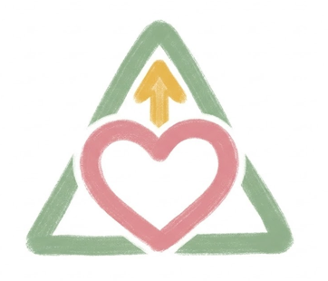

# Triangle of Love Coach

Triangle of Love Coach is a mobile-first web app for couples to build better habits through tiny daily check-ins and a weekly relationship review. It uses Sternberg's Triangle of Love (Intimacy, Passion, Commitment) to show trends and suggest one clear next move each week.

## References

- [DEVELOPMENT.md](DEVELOPMENT.md): Local setup, Docker commands, and API test execution workflow.
- [CONSTITUTION.md](CONSTITUTION.md): Project architecture rules, layering boundaries, and delivery expectations.
- [DESIGN.md](DESIGN.md): Product and technical design direction, including deployment notes.
- [PRD.md](PRD.md): Product requirements, scope, and intended user experience.
- [docs/flow.md](docs/flow.md): User and system flow documentation.

## First Time Here

1. Create your account.
2. Invite your partner with a link or code.
3. Set your daily reminder window and weekly review time.
4. Do your first quick check-in (about 30-60 seconds).

## How It Works

- Daily: rate up to 5 short questions (stars), optional private note.
- Weekly: rate Intimacy, Passion, Commitment + add private reflections (about 5 minutes).
- After weekly review: get one primary "wingman move" (plus one optional bonus action).

## Privacy First

- Reflection text is private by default.
- The app avoids blame and scorekeeping.
- Partner-confirmed achievements are optional and opt-in.

## Important

This is a coaching tool, not therapy.