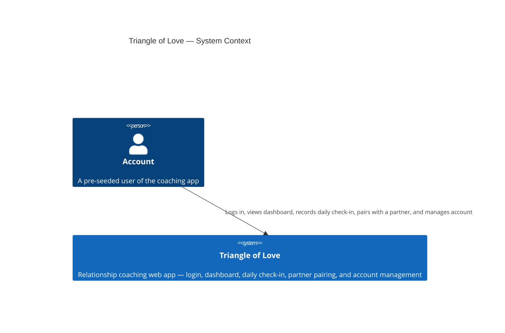
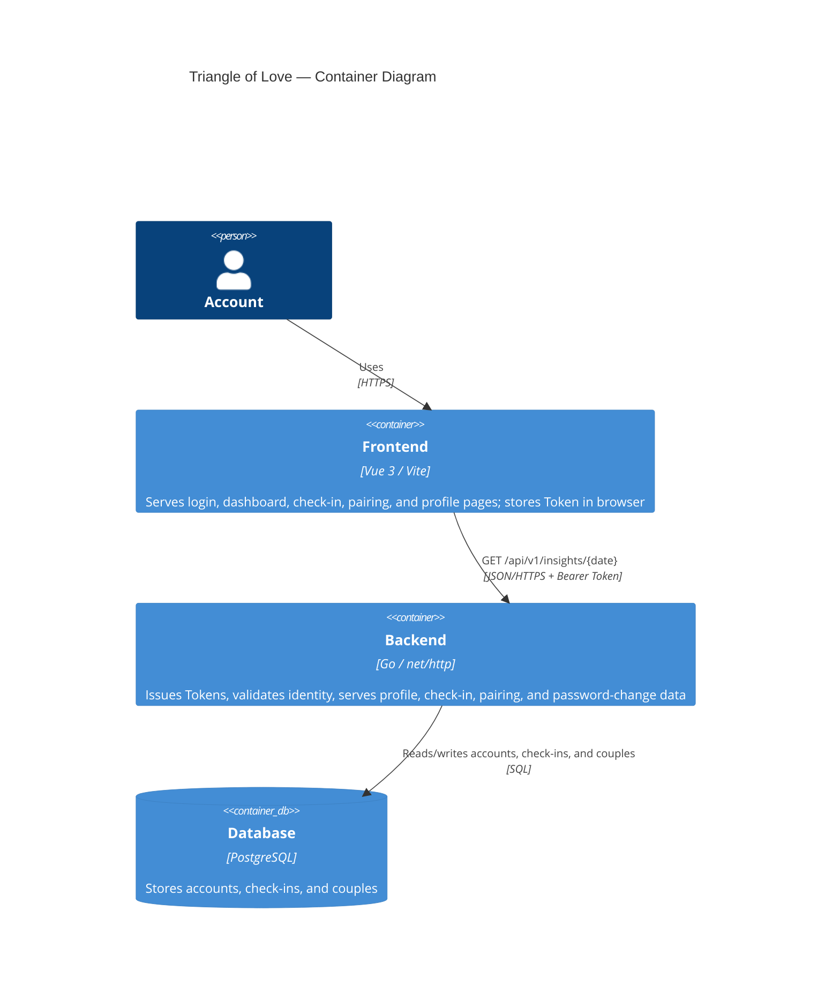

# Architecture

## System Context

```mermaid
C4Context
    title Triangle of Love — System Context
    Person(account, "Account", "A pre-seeded user of the coaching app")
    System(tol, "Triangle of Love", "Relationship coaching web app — login, dashboard, daily check-in, partner pairing, and account management")
    Rel(account, tol, "Logs in, views dashboard, records daily check-in, pairs with a partner, and manages account")
```

## Container Diagram

```mermaid
C4Container
    title Triangle of Love — Container Diagram
    Person(account, "Account")
    Container(frontend, "Frontend", "Vue 3 / Vite", "Serves login, dashboard, check-in, pairing, and profile pages; stores Token in browser")
    Container(backend, "Backend", "Go / net/http", "Issues Tokens, validates identity, serves profile, check-in, pairing, and password-change data")
    ContainerDb(db, "Database", "PostgreSQL", "Stores accounts, check-ins, and couples")
    Rel(account, frontend, "Uses", "HTTPS")
    Rel(frontend, backend, "POST /api/v1/auth/login", "JSON/HTTPS")
    Rel(frontend, backend, "POST /api/v1/register", "JSON/HTTPS")
    Rel(frontend, backend, "PUT /api/v1/auth/password", "JSON/HTTPS + Bearer Token")
    Rel(frontend, backend, "GET /api/v1/users/me", "JSON/HTTPS + Bearer Token")
    Rel(frontend, backend, "GET /api/v1/sessions/today", "JSON/HTTPS + Bearer Token")
    Rel(frontend, backend, "PUT /api/v1/sessions/today", "JSON/HTTPS + Bearer Token")
    Rel(frontend, backend, "GET /api/v1/pairing", "JSON/HTTPS + Bearer Token")
    Rel(frontend, backend, "POST /api/v1/pairing/regenerate", "JSON/HTTPS + Bearer Token")
    Rel(frontend, backend, "POST /api/v1/pairing/connect", "JSON/HTTPS + Bearer Token")
    Rel(frontend, backend, "GET /api/v1/couples/me", "JSON/HTTPS + Bearer Token")
    Rel(frontend, backend, "DELETE /api/v1/couples/me", "JSON/HTTPS + Bearer Token")
    Rel(frontend, backend, "GET /api/v1/insights", "JSON/HTTPS + Bearer Token")
    Rel(frontend, backend, "GET /api/v1/insights/{date}", "JSON/HTTPS + Bearer Token")
    Rel(backend, db, "Reads/writes accounts, check-ins, and couples", "SQL")
```

## Backend Component Diagram

```mermaid
C4Component
    title Backend — Component Diagram
    Container(frontend, "Frontend", "Vue 3", "Calls API")
    Component(domain, "Domain Package", "Go", "Defines Account, Checkin, CoupleSummary, InviteCode, and ErrNotFound. Zero dependencies.")
    Component(authHandler, "Auth Handler", "Go / net/http", "Handles POST /api/v1/auth/login")
    Component(registrationHandler, "Registration Handler", "Go / net/http", "Handles POST /api/v1/register")
    Component(changePasswordHandler, "Change Password Handler", "Go / net/http", "Handles PUT /api/v1/auth/password")
    Component(meHandler, "Me Handler", "Go / net/http", "Handles GET /api/v1/users/me")
    Component(jwtMiddleware, "JWT Middleware", "Go", "Validates Bearer Token; rejects with 401 if absent or invalid")
    Component(authService, "Auth Service", "Go", "Orchestrates registration validation, account creation, login, and token issuance")
    Component(accountRepo, "Account Repository", "Go / sql", "Reads and writes Account records; FindByEmail, FindByID, SaveHashedPassword")
    Component(checkinHandler, "Session Handler", "Go / net/http", "Handles GET and PUT /api/v1/sessions/today")
    Component(checkinService, "Session Service", "Go", "Orchestrates load and upsert of a daily session for today")
    Component(checkinRepo, "Check-in Repository", "Go / sql", "Reads and upserts rows in the checkins table")
    Component(pairingHandler, "Pairing Handler", "Go / net/http", "Handles GET /api/v1/pairing, POST /api/v1/pairing/regenerate, POST /api/v1/pairing/connect, GET /api/v1/couples/me, DELETE /api/v1/couples/me")
    Component(pairingService, "Pairing Service", "Go", "Orchestrates invite code generation, Couple formation, and Unpair")
    Component(pairingRepo, "Pairing Repository", "Go / sql", "Reads and writes invite_code on the accounts table")
    Component(coupleRepo, "Couple Repository", "Go / sql", "Reads and writes the couples table; filters active couples by ended_on IS NULL; sets ended_on on Unpair")
    Component(insightsHandler, "Insights Handler", "Go / net/http", "Handles GET /api/v1/insights/{date}")
    Component(insightsWeeklyHandler, "Insights Weekly Handler", "Go / net/http", "Handles GET /api/v1/insights")
    Component(insightsService, "Insights Service", "Go", "Computes daily and weekly insight scores from check-in data")
    Component(insightsRepo, "Insights Repository", "Go / sql", "Reads check-in rows for insight score computation")
    ContainerDb(db, "Database", "PostgreSQL", "accounts, checkins, and couples tables")
    Rel(frontend, authHandler, "POST /api/v1/auth/login")
    Rel(frontend, registrationHandler, "POST /api/v1/register")
    Rel(frontend, jwtMiddleware, "PUT /api/v1/auth/password + Bearer Token")
    Rel(frontend, jwtMiddleware, "GET /api/v1/users/me + Bearer Token")
    Rel(frontend, jwtMiddleware, "GET|PUT /api/v1/sessions/today + Bearer Token")
    Rel(frontend, jwtMiddleware, "GET /api/v1/pairing + Bearer Token")
    Rel(frontend, jwtMiddleware, "POST /api/v1/pairing/* + Bearer Token")
    Rel(frontend, jwtMiddleware, "GET /api/v1/couples/me + Bearer Token")
    Rel(frontend, jwtMiddleware, "DELETE /api/v1/couples/me + Bearer Token")
    Rel(frontend, jwtMiddleware, "GET /api/v1/insights + Bearer Token")
    Rel(frontend, jwtMiddleware, "GET /api/v1/insights/{date} + Bearer Token")
    Rel(jwtMiddleware, changePasswordHandler, "Passes verified accountId")
    Rel(jwtMiddleware, meHandler, "Passes verified identity")
    Rel(jwtMiddleware, checkinHandler, "Passes verified accountId")
    Rel(jwtMiddleware, pairingHandler, "Passes verified accountId")
    Rel(authHandler, authService, "login(credentials)")
    Rel(registrationHandler, authService, "register(email, password, firstName)")
    Rel(changePasswordHandler, authService, "changePassword(accountID, current, new)")
    Rel(meHandler, authService, "getProfile(accountId)")
    Rel(authService, accountRepo, "FindByEmail / FindByID / SaveHashedPassword")
    Rel(accountRepo, domain, "returns domain.Account / domain.ErrNotFound")
    Rel(accountRepo, db, "SQL query")
    Rel(checkinHandler, checkinService, "getToday / saveToday")
    Rel(checkinService, checkinRepo, "FindByAccountAndDate / Save")
    Rel(checkinRepo, domain, "returns domain.Checkin / domain.ErrNotFound")
    Rel(checkinRepo, db, "SQL select / upsert")
    Rel(pairingHandler, pairingService, "getOrCreateCode / regenerateCode / connect / getCoupleStatus / unpair")
    Rel(pairingService, pairingRepo, "FindInviteCodeByAccountID / SaveInviteCode / FindByInviteCode / ExistsCoupleByAccountID")
    Rel(pairingService, coupleRepo, "Save / FindByAccountID / Unpair")
    Rel(pairingRepo, domain, "returns domain.InviteCode / domain.ErrNotFound")
    Rel(coupleRepo, domain, "returns domain.CoupleSummary / domain.ErrNotFound")
    Rel(pairingRepo, db, "SQL — accounts.invite_code")
    Rel(coupleRepo, db, "SQL — couples table")
    Rel(jwtMiddleware, insightsHandler, "Passes verified accountId")
    Rel(jwtMiddleware, insightsWeeklyHandler, "Passes verified accountId")
    Rel(insightsHandler, insightsService, "getByDate(accountID, date)")
    Rel(insightsWeeklyHandler, insightsService, "getWeekly(accountID)")
    Rel(insightsService, insightsRepo, "FindByAccountAndDate")
    Rel(insightsRepo, domain, "returns domain.DailyInsight / domain.WeeklyInsight / domain.ErrNotFound")
    Rel(insightsRepo, db, "SQL — checkins table")
```
