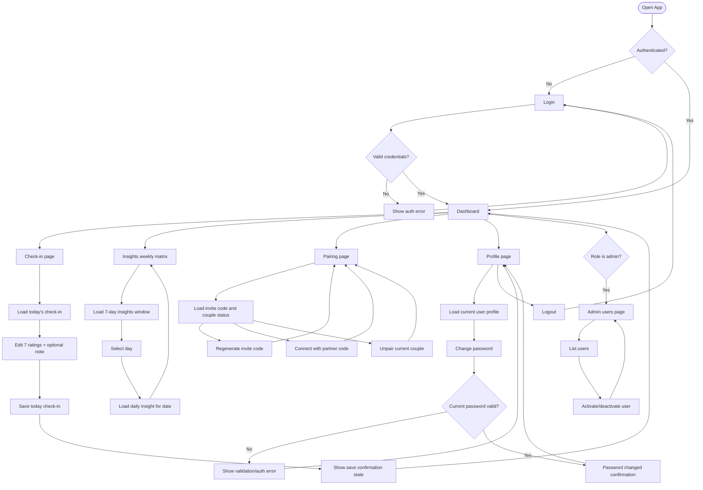

# Triangle of Love — Implemented User Flow (Current)

This document reflects the **currently implemented** navigation and interaction flows in the codebase.

---

## 1) Activity Diagram (Current)

---

## 2) Screen Map (Current Routes)

### Public
- **P1** Login (`/login`)
- **P2** Register (`/register`)

### Authenticated
- **A1** Dashboard (`/dashboard`)
- **A2** Session (`/session`)
- **A3** Insights weekly (`/insights`)
- **A4** Pairing (`/pairing`)
- **A5** Profile (`/profile`)

### Admin
- **ADM1** Admin users (`/admin/users`)

---

## 3) Implemented UX Rules

- Sessions are **daily** and saved at `GET/PUT /api/v1/sessions/today`.
- Check-in inputs are seven ratings (six relationship metrics + mood) plus an optional private note.
- Insights include:
  - weekly matrix view from `GET /api/v1/insights`
  - per-date insight view from `GET /api/v1/insights/{date}`
- Pairing supports invite code retrieval/regeneration, connect, and unpair.
- Profile supports viewing own account and changing password.
- Admin users can list accounts and toggle activation state.

---

## 4) Not Implemented Yet

The following concepts appear in product planning docs but are not currently present in the app flow:
- Weekly session flow
- Impulse generation and selection
- Monthly shared session trigger questions
- Achievements flow
